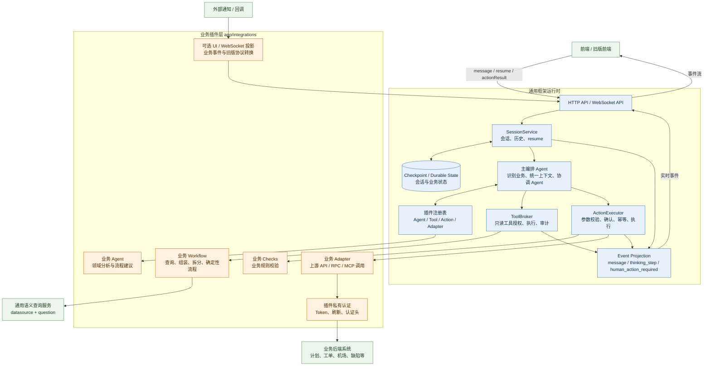

# AI Decision 架构图

AI Decision 是一个以 `session_id` 为会话边界、以插件为业务扩展单位的多 Agent 决策与执行框架。
通用运行时只负责协议、会话、编排、工具代理、动作确认、事件投影和持久化；具体业务规则与外部系统调用全部位于对应的 integration 插件中。

## 总体架构



## 一次请求如何流转

1. 前端通过 HTTP 或 WebSocket 发送带 `session_id` 的消息。
2. `SessionService` 读取同一会话上下文，交给主编排 Agent。
3. 主编排 Agent 根据插件注册表选择业务 Agent，并统一维护上下文。
4. 只读查询经过 `ToolBroker`；真实写操作经过 `ActionExecutor`。
5. `ActionExecutor` 先执行通用协议层的参数校验、确认和幂等处理，再调用插件的业务校验与 Adapter。
6. Adapter 使用插件自己的认证和配置访问业务后端，不把业务 URL、Token 或字段泄漏到通用配置。
7. 运行过程由统一事件投影输出 `thinking_step`；需要用户确认时输出 `human_action_required`。
8. 用户的 `resume` 或插件转换后的 `actionResult` 回到同一个 `session_id`，继续原业务流程。

## 通用层与插件层的边界

| 层 | 负责内容 | 不应包含的内容 |
| --- | --- | --- |
| 通用框架 | 会话、历史、主编排、工具代理、动作协议、确认、事件、持久化 | 巡检字段、巡检步骤、某个业务的 URL 和认证逻辑 |
| 业务插件 | 领域 Agent、查询工具、业务 Workflow、规则、Adapter、通知转换 | 修改主 Agent 或在通用服务中增加业务分支 |
| 外部系统 | 真实计划、工单、机场和其他业务数据 | 由框架直接拼接业务请求 |

## 插件扩展点

新增业务通常只需要新增 `app/integrations/<business>/`，并通过 `bundle.py` 注册：

```text
<business>/
├── bundle.py       # 插件唯一注册入口
├── agent.py        # 业务 Agent 声明
├── workflows.py    # 查询与确定性流程
├── actions.py      # ActionSpec
├── models.py       # 输入输出模型
├── checks.py       # 业务规则校验
├── adapter.py      # 外部系统调用
├── config.py       # 插件私有配置
├── ui.py           # 可选事件投影
└── routes.py       # 可选业务回调接口
```

因此，加入新的 Agent 的主要变化发生在插件目录和注册表中，通用会话、WebSocket、确认协议和实时进度通道可以继续复用。

详细接入步骤见 [插件接入指南](plugin-integration-guide.md)。
